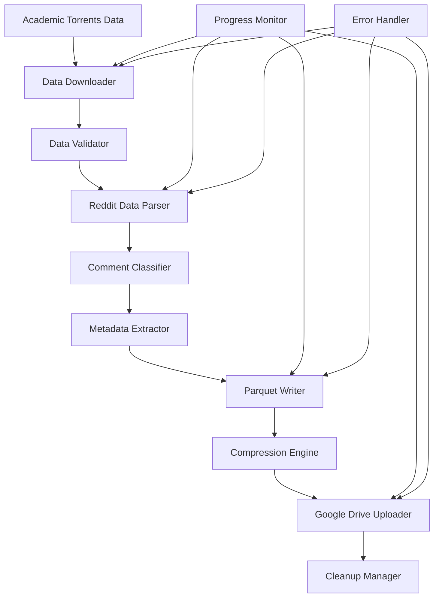

# Design Document

## Overview

This system processes Reddit data from Academic Torrents to create specialized datasets of deleted and moderator-removed comments. The architecture focuses on efficient data processing, storage optimization using Parquet compression, and cloud storage integration to handle large datasets with limited local storage.

The system will distinguish between user-deleted comments ("[deleted]") and moderator-removed comments ("[removed]"), creating separate training datasets optimized for machine learning workflows.

## Architecture

### High-Level Architecture



### Component Flow

1. **Data Acquisition Layer**: Downloads and validates Reddit dataset
2. **Processing Layer**: Parses JSON data and classifies comments
3. **Storage Layer**: Creates compressed Parquet files
4. **Cloud Integration Layer**: Uploads to Google Drive and manages local storage

## Components and Interfaces

### 1. Data Downloader (`data_downloader.py`)

**Purpose**: Downloads Reddit dataset from Academic Torrents
**Key Methods**:
- `download_dataset(torrent_url: str) -> str`: Downloads torrent data
- `verify_integrity(file_path: str) -> bool`: Validates downloaded files
- `extract_files(archive_path: str) -> List[str]`: Extracts compressed archives

**Dependencies**: `requests`, `hashlib`, `zipfile`/`tarfile`

### 2. Reddit Data Parser (`reddit_parser.py`)

**Purpose**: Parses Reddit JSON data files efficiently
**Key Methods**:
- `parse_comments_file(file_path: str) -> Iterator[Dict]`: Streams comment data
- `parse_submissions_file(file_path: str) -> Iterator[Dict]`: Streams submission data
- `chunk_processor(file_path: str, chunk_size: int) -> Iterator[List[Dict]]`: Memory-efficient processing

**Data Format**: Handles Reddit's JSON format with fields like `body`, `author`, `created_utc`, `subreddit`

### 3. Comment Classifier (`comment_classifier.py`)

**Purpose**: Identifies and categorizes deleted/removed comments
**Key Methods**:
- `classify_comment(comment: Dict) -> str`: Returns "user_deleted", "moderator_removed", or "active"
- `is_deleted_comment(comment: Dict) -> bool`: Checks for deletion markers
- `extract_removal_context(comment: Dict) -> Dict`: Gathers removal metadata

**Classification Logic**:
- `body == "[deleted]"` → User deleted
- `body == "[removed]"` → Moderator removed  
- `author == "[deleted]"` → User deleted (account level)

### 4. Metadata Extractor (`metadata_extractor.py`)

**Purpose**: Extracts relevant metadata for ML training datasets
**Key Methods**:
- `extract_comment_metadata(comment: Dict) -> Dict`: Core metadata extraction
- `generate_training_labels(comment: Dict, context: Dict) -> str`: Creates ML labels
- `build_training_record(comment: Dict) -> Dict`: Formats for train.parquet

**Output Schema**:
```python
{
    'id': str,                    # Comment ID
    'comment_text': str,          # Original text (if available)
    'subreddit': str,             # Subreddit name
    'timestamp': datetime,        # Creation timestamp
    'removal_type': str,          # "deleted" or "removed"
    'target_label': str,          # ML label (toxic, spam, etc.)
    'parent_id': str,             # Parent comment/post ID
    'thread_id': str,             # Submission ID
    'score': int,                 # Comment score (if available)
}
```

### 5. Parquet Writer (`parquet_writer.py`)

**Purpose**: Creates compressed Parquet datasets
**Key Methods**:
- `write_dataset(data: Iterator[Dict], output_path: str, compression: str) -> str`
- `create_chunked_parquet(data: Iterator[Dict], chunk_size: int) -> List[str]`
- `optimize_schema(data_sample: List[Dict]) -> pyarrow.Schema`

**Compression Strategy**:
- Primary: `snappy` (fast compression/decompression)
- Alternative: `gzip` (better compression ratio)
- Chunking: 100,000 records per chunk to manage memory

### 6. Google Drive Uploader (`drive_uploader.py`)

**Purpose**: Handles Google Drive API integration
**Key Methods**:
- `authenticate() -> googleapiclient.discovery.Resource`: OAuth2 authentication
- `upload_file(file_path: str, drive_folder: str) -> str`: Uploads with progress
- `create_folder(folder_name: str) -> str`: Creates organized folder structure
- `get_upload_progress() -> float`: Returns upload percentage

**Authentication**: Uses OAuth2 with `credentials.json` and token caching

### 7. Progress Monitor (`progress_monitor.py`)

**Purpose**: Tracks processing progress and system resources
**Key Methods**:
- `update_progress(stage: str, current: int, total: int) -> None`
- `monitor_memory_usage() -> Dict`: Tracks RAM usage
- `log_processing_stats(stats: Dict) -> None`: Logs performance metrics

### 8. Cleanup Manager (`cleanup_manager.py`)

**Purpose**: Manages local storage and file cleanup
**Key Methods**:
- `cleanup_local_files(file_paths: List[str]) -> None`
- `check_disk_space() -> float`: Returns available GB
- `archive_processed_files(file_paths: List[str]) -> str`: Creates backup archives

## Data Models

### Comment Record Schema

```python
@dataclass
class CommentRecord:
    id: str
    comment_text: Optional[str]
    subreddit: str
    timestamp: datetime
    removal_type: str  # "deleted", "removed", "active"
    target_label: Optional[str]  # ML training label
    parent_id: Optional[str]
    thread_id: str
    score: Optional[int]
    author: Optional[str]  # "[deleted]" for deleted users
```

### Processing Statistics

```python
@dataclass
class ProcessingStats:
    total_comments: int
    user_deleted: int
    moderator_removed: int
    active_comments: int
    processing_time: float
    memory_peak: float
    files_created: List[str]
    upload_status: Dict[str, str]
```

## Error Handling

### Error Categories

1. **Network Errors**: Download failures, API timeouts
2. **Data Errors**: Malformed JSON, missing fields
3. **Storage Errors**: Disk space, permission issues
4. **API Errors**: Google Drive authentication, quota limits

### Error Recovery Strategies

- **Retry Logic**: Exponential backoff for network operations
- **Graceful Degradation**: Continue processing other files on single file failure
- **Checkpoint System**: Save progress to resume interrupted processing
- **Fallback Storage**: Local storage if Drive upload fails

### Error Logging

```python
# Error logging format
{
    "timestamp": "2024-01-01T12:00:00Z",
    "level": "ERROR",
    "component": "reddit_parser",
    "error_type": "JSONDecodeError",
    "file_path": "/path/to/file.json",
    "line_number": 12345,
    "message": "Invalid JSON format",
    "recovery_action": "skipped_record"
}
```

## Testing Strategy

### Unit Tests

- **Data Parser Tests**: Validate JSON parsing with malformed data
- **Classifier Tests**: Test comment classification accuracy
- **Parquet Writer Tests**: Verify compression and schema correctness
- **Drive Uploader Tests**: Mock API calls and test error handling

### Integration Tests

- **End-to-End Pipeline**: Process sample Reddit data through full pipeline
- **Memory Stress Tests**: Process large datasets to validate memory management
- **Storage Tests**: Verify Parquet file integrity and compression ratios

### Performance Tests

- **Throughput Benchmarks**: Comments processed per second
- **Memory Usage Profiling**: Peak memory consumption patterns
- **Compression Efficiency**: Size reduction ratios for different compression algorithms

### Test Data

- **Sample Reddit Data**: Curated dataset with known deleted/removed comments
- **Edge Cases**: Empty comments, special characters, Unicode text
- **Large Dataset Simulation**: Synthetic data for stress testing

## Configuration Management

### Environment Variables

```bash
# Google Drive API
GOOGLE_DRIVE_CREDENTIALS_PATH="/path/to/credentials.json"
GOOGLE_DRIVE_FOLDER_ID="your_folder_id"

# Processing Configuration
CHUNK_SIZE=100000
COMPRESSION_TYPE="snappy"
MAX_MEMORY_GB=8

# Storage Management
AUTO_CLEANUP=true
KEEP_LOCAL_BACKUP=false
DISK_SPACE_THRESHOLD_GB=5
```

### Configuration File (`config.yaml`)

```yaml
processing:
  chunk_size: 100000
  max_workers: 4
  memory_limit_gb: 8

storage:
  compression: "snappy"
  parquet_version: "2.6"
  auto_cleanup: true
  backup_enabled: false

google_drive:
  folder_name: "Reddit_Deleted_Comments"
  upload_timeout: 300
  retry_attempts: 3

logging:
  level: "INFO"
  file_path: "processing.log"
  max_size_mb: 100
```